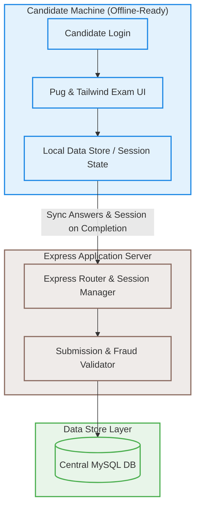

# 📝 Exam Panel

> **Smart Hiring Starts Here**
> *A recruitment exam platform supporting both online and offline modes for candidate assessment.*

---

## 📌 Project Overview

| Attribute | Details |
| :--- | :--- |
| **Client** | Private Banks |
| **Role** | Full-Stack Development |
| **Duration** | 4 Months |
| **Category** | Software / Recruitment Platform |
| **Main Tech Stack** | Node.js, Express, Pug, Tailwind CSS, MySQL, AWS, GitHub Actions |
| **Live Demo** | [exampanel.example.com](https://exampanel.example.com) |
| **GitHub Repository** | [github.com/example/exam-panel](https://github.com/example/exam-panel) |

---

## 🗒️ Description

Exam Panel is a full-stack recruitment exam platform built for private banks, enabling secure, proctored candidate assessments in both online and offline environments.

Our team developed Exam Panel as a robust, deployment-friendly solution for organizations that need to conduct high-stakes recruitment exams at scale — with or without reliable internet access.

---

## 📈 Impact & Performance Metrics

Our engineering effort focused on optimizing speed, reliability, and deployment time to satisfy high-stakes assessment criteria:

```
┌─────────────────────────┐   ┌─────────────────────────┐   ┌─────────────────────────┐
│  Setup Time / Machine   │   │    Exam Reliability     │   │  Deployment Efficiency  │
│        < 2 min          │   │         99.8%           │   │           8x            │
└─────────────────────────┘   └─────────────────────────┘   └─────────────────────────┘
```

* **Performance Score:** `96 / 100`
* **SEO Score:** `85 / 100`
* **Loading Speed:** `1.2s` average page load
* **User Growth:** `150% YoY` increase in candidate capacity
* **Client Satisfaction:** `5 / 5` rated by recruitment admins

---

## 🔍 Case Study: Overview

### The Problem
Most exam platforms require a constant, stable online connection or a custom OS/software installation on every candidate machine. For large-scale recruitment drives, this process is lengthy, costly, and technically demanding — especially at remote test centers with poor internet availability.

### The Goal
Build a lightweight, highly secure, and proctored exam software platform that runs seamlessly in both online and offline modes, requiring minimal setup time (< 2 minutes) on candidate machines.

### The Solution
A Node.js and Express-based exam platform with a Pug + Tailwind frontend, supporting offline-first operation, secure session management, and a centralized MySQL database for result aggregation.

### Business Impact
Enabled private banks to conduct large-scale recruitment exams with zero dependency on internet connectivity at test centers, significantly reducing setup time and operational costs.

---

## 🛠️ Key Features

* **Secure Candidate Authentication & Session Management** — Multi-factor candidate verification and session preservation.
* **Online & Offline Exam Mode Support** — Exams run fully offline once loaded, resilient to complete network failure.
* **Auto-sync Results When Connectivity Restored** — Automatic result buffering and syncing back to the central server when connectivity is restored.
* **Lightweight Installer for Quick Deployment** — One-click lightweight packaging for quick deployment without OS customizations.
* **Admin Dashboard for Exam & Candidate Management** — Central panel for question pool management, exam scheduling, and real-time candidate monitoring.
* **Randomized Question Paper Generation** — Dynamic paper compilation preventing candidate collusion.
* **Responsive Mobile-First UI** — Responsive layout supporting tablets and laptops.

---

## 🔧 Tech Stack

### Frontend
* Pug
* Tailwind CSS

### Backend
* Node.js
* Express

### Database
* MySQL

### Cloud
* AWS

### DevOps
* GitHub Actions

---

## 📐 System Architecture

### Process Flow Diagram



### Flow Breakdown

1. **Frontend Flow:**
   Candidate logs in → Pug-rendered exam interface loads questions → Answers stored locally → Submitted to server on completion or sync.

2. **Backend Flow:**
   Express server handles auth & session → Serves exam data → Receives and validates submissions → Stores results in MySQL.

3. **Database Schema:**
   Candidates (MySQL) <-> Exams (MySQL) <-> Questions (MySQL) <-> Results (MySQL).

---

## 💡 Challenges & Solutions

| Challenge | Technical Solution |
| :--- | :--- |
| **Running exams reliably with no internet access** | Implemented an offline-first architecture where exam data is cached locally and results are synced to the server once connectivity is restored. |
| **Preventing cheating and ensuring exam integrity across candidate machines** | Full-screen enforcement, and session-locking mechanisms that auto-flag suspicious behavior. |
| **Deploying quickly across hundreds of machines without technical staff** | Packaged the application as a lightweight installer that requires no OS customization, reducing per-machine setup time to under 2 minutes. |

---

## 🗣️ Testimonial

> "The Exam Panel completely transformed how we conduct recruitment. The offline mode alone saved us from countless logistical nightmares at remote test centers."
>
> **— Ayesha Raza**, *HR Director, Private Banking Group* ★★★★★

---

## 🔗 Related Projects

* [`scribe-ai-platform`](../scribe-ai-platform) — AI-powered transcription and assessment scoring platform.
* [`apex-logistics-cloud`](../apex-logistics-cloud) — Distributed resource planning and logistics portal.
